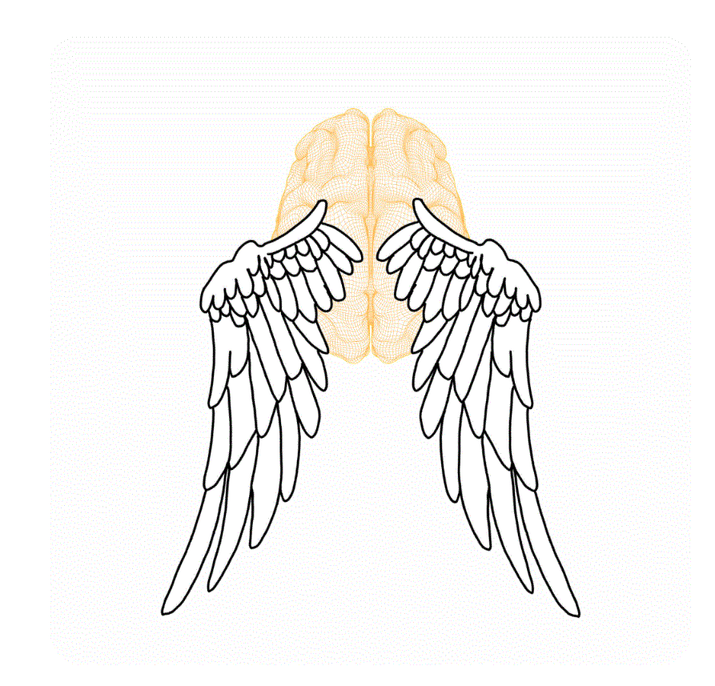

# 🚀 SkyCortex OS Portfolio

Welcome to **SkyCortex OS**, my digital creative laboratory.

This portfolio showcases a growing collection of interactive projects that combine programming, creative coding, artificial intelligence, digital art, scientific visualization, and storytelling. Every project is designed, developed, and continuously expanded as part of an evolving ecosystem of original ideas.

---

# 🌌 What You'll Discover

Inside SkyCortex you'll find projects across multiple disciplines:

* 🌙 Astronomy and space visualization
* 🧪 Creative coding experiments
* 🎨 Interactive digital art
* 📊 Data visualization
* 🐱 Interactive game systems
* 🤖 AI-assisted development
* 💻 Web applications
* 📖 Digital storytelling

Each project represents a step in my journey as both a creative technologist and an independent developer.

---

# 🚀 Featured Projects

Current projects include:

* 🌌 Northern Light Research Station
* 🌙 Lunar Visualization Lab
* 🌕 Moon Calendar
* 🐱 Maneko Neki Universe
* 🧪 Green Circles
* 🎨 Creative Coding Experiments
* 📊 Interactive Data Visualizations
* 💻 Web Development Projects

The laboratory continues to expand as new ideas become fully interactive experiences.

---

# 🎮 Current Development

One of my main ongoing projects is **Maneko Neki Universe**, an original interactive platform that combines tarot, storytelling, and custom game systems.

The project currently includes:

* Custom Tarot Engine
* Five interactive tarot spreads
* Oraculum system
* Dynamic reading generation
* Upright and reversed interpretations
* Interactive astronomical tools
* Lunar calendar integration
* Live Moon Phase visualization
* NOAA-powered Northern Light Research Station

The long-term vision is to create an intelligent system capable of generating increasingly personalized interactive experiences.

---

# 🧪 SkyCortex Philosophy

SkyCortex is built around experimentation.

Some ideas become complete applications.
Others remain prototypes that explore new technologies, creative concepts, or interface design.

Every experiment contributes to learning, improving, and discovering new possibilities through software.

---

# 🤝 Collaboration

I'm always interested in connecting with:

* Creative developers
* Researchers
* Designers
* Artists
* Open-source contributors
* Technology enthusiasts
* Potential collaborators

If you enjoy creative technology, interactive systems, or experimental software, I'd love to connect.

---

# 🛠 Technologies

* HTML5
* CSS3
* JavaScript
* Python
* JSON
* GitHub Pages
* Creative Coding
* Canvas API
* Data Visualization
* Responsive Design

---

# 🌐 Portfolio

Explore the live SkyCortex Portfolio and discover the complete collection of projects.

---

© 2026 Gloria Martinez

All projects, source code, illustrations, designs, software architecture, and interactive experiences presented in SkyCortex are original creations by the author.
